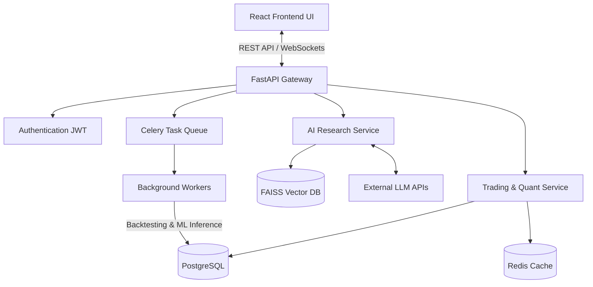

<div align="center">
  <h1>🚀 QuantPilot AI</h1>
  <p><strong>AI-powered Quantitative Research and Algorithmic Trading Platform</strong></p>
  
  [](#)
  [](https://opensource.org/licenses/MIT)
  [](https://www.python.org/)
  [](https://reactjs.org/)
  [](https://fastapi.tiangolo.com/)
</div>

<br />

## 📖 Overview

**QuantPilot AI** is an enterprise-grade, full-stack quantitative research platform designed for modern financial analysis. It bridges the gap between traditional quantitative backtesting and cutting-edge artificial intelligence, offering a suite of tools typically found in institutional platforms like the Bloomberg Terminal, enhanced with LLM-assisted research capabilities.

This platform enables researchers, data scientists, and traders to develop algorithmic strategies, execute high-fidelity backtests, optimize portfolios using Modern Portfolio Theory, and interact with complex financial documents (10-Ks, PDFs, CSVs) via an intelligent Retrieval-Augmented Generation (RAG) assistant.

---

## ✨ Core Features

### 🧠 AI Financial Research Assistant
*   **RAG Pipeline:** Chat directly with SEC filings, earnings call transcripts, and custom datasets.
*   **Powered by LLMs:** Integration with LangChain, FAISS, and state-of-the-art models (OpenAI/Gemini).
*   **Financial Reasoning:** Ability to extract metrics, summarize news sentiment, and perform natural language portfolio queries.

### 📈 Quantitative Backtesting Engine
*   **Vectorized Execution:** Blazing fast backtests utilizing `VectorBT` and `Pandas`.
*   **Advanced Analytics:** Calculates risk-adjusted metrics including Sharpe Ratio, Maximum Drawdown, Beta, and Alpha.
*   **Portfolio Optimization:** Implementation of Mean-Variance Optimization and Monte Carlo simulations via `PyPortfolioOpt`.

### 🖥️ High-Performance Trading Terminal
*   **Real-time Visualization:** Integrated `TradingView Lightweight Charts` for zero-lag candlestick charting and order book simulation.
*   **Custom Dashboard:** Dynamic UI built with React, TypeScript, and Redux Toolkit for seamless state management.

### ⚙️ Distributed Event-Driven Architecture
*   **Asynchronous Processing:** Celery and Redis handle heavy ML inferences and backtesting workloads in the background, ensuring a non-blocking API.
*   **Microservices Ready:** Built with FastAPI, strictly typed via Pydantic, and containerized with Docker for scalable deployment.

---

## 🛠️ Technology Stack

| Component | Technologies Used |
| :--- | :--- |
| **Frontend** | React, TypeScript, TailwindCSS, shadcn/ui, Redux Toolkit, TradingView Charts |
| **Backend API** | FastAPI, Python, SQLAlchemy, Pydantic, JWT Auth |
| **Data & Cache** | PostgreSQL (Primary), Redis (Cache & Message Broker), FAISS (Vector Search) |
| **AI / Machine Learning** | LangChain, OpenAI / Gemini APIs, Sentence Transformers |
| **Quantitative Libraries** | Pandas, NumPy, VectorBT, PyPortfolioOpt |
| **DevOps & Infra** | Docker, Celery (Workers), GitHub Actions (CI/CD) |

---

## 🏗️ System Architecture



---

## 🗺️ Development Roadmap

QuantPilot AI is being developed in a structured, phased approach to ensure robust architecture and steady feature delivery.

### Phase 1: Minimum Viable Product (MVP) 🚀 *(Current Phase)*
- [ ] Implement Authentication (JWT, OAuth)
- [ ] Scaffold FastAPI backend and PostgreSQL schema
- [ ] Build React/Tailwind Dashboard UI
- [ ] Integrate Market Data API and TradingView Charts
- [ ] Deploy basic AI Chat module with LangChain and FAISS
- [ ] Implement basic Portfolio tracking and Watchlists

### Phase 2: Quantitative Engine & Strategy Builder 📊
- [ ] Integrate VectorBT for high-speed backtesting
- [ ] Implement Portfolio Optimization (Modern Portfolio Theory)
- [ ] Build visual Strategy Builder in the UI
- [ ] Develop Paper Trading module with virtual PnL tracking
- [ ] Expand AI capabilities for News Sentiment Intelligence

### Phase 3: Scale & Productionization 🌐
- [ ] Decompose monolithic API into dedicated microservices
- [ ] Implement advanced observability (Prometheus, Grafana)
- [ ] Containerize full stack with Docker Compose
- [ ] Setup complete CI/CD pipelines via GitHub Actions

---

## 💻 Local Development Setup

*(Setup instructions will be populated as Phase 1 backend scaffolding is completed).*

```bash
# Clone the repository
git clone https://github.com/yourusername/quantpilot-ai.git

# Navigate to project directory
cd quantpilot-ai

# Instructions for Docker and local environment setup coming soon...
```

---

## 📝 License

Distributed under the MIT License. See `LICENSE` for more information.
