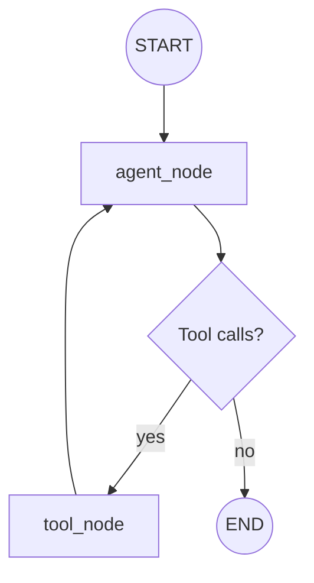
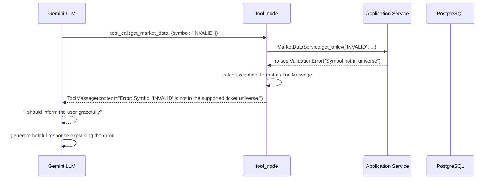
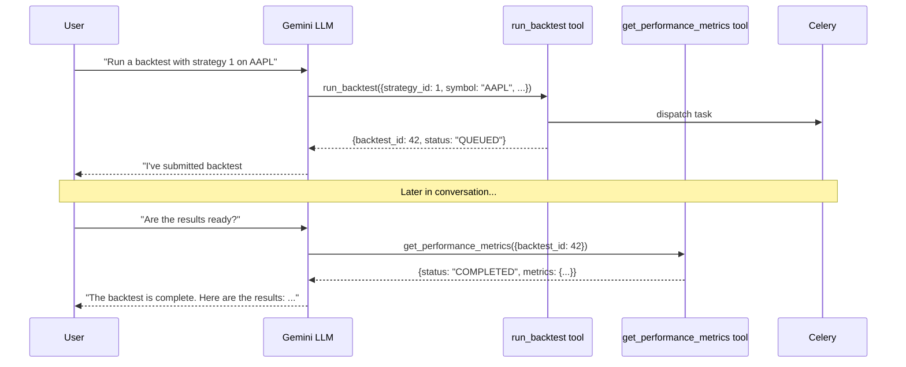
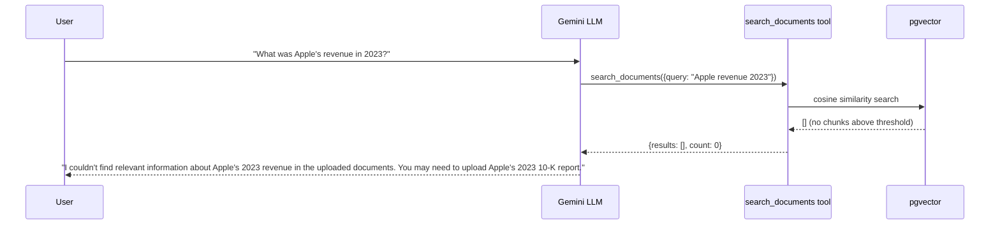

# QuantPilot AI — AI Architecture

## 1. Core Principle

> **The LLM never computes a number itself. It decides which tool to call, the tool returns ground truth, and the LLM explains the result.**

```text
LLM reasoning:    "What should I do?"  "Which tool?"  "How do I explain this?"
Deterministic:    prices, indicators, metrics, retrieved chunks
Async:            backtests, embedding generation
```

---

## 2. LangGraph Agent Design

### 2.1 Graph Structure



### 2.2 State Definition

```python
class AgentState(TypedDict):
    messages: Annotated[list[BaseMessage], add_messages]
    # LangGraph manages message accumulation via the add_messages reducer
```

The state is intentionally minimal. LangGraph's `add_messages` reducer handles message accumulation automatically. No custom memory architecture.

### 2.3 Nodes

#### `agent_node`

- **Input**: Current `AgentState` (message history)
- **Action**: Invokes Gemini LLM with messages + bound tool schemas
- **Output**: Either a response with tool calls, or a final text response
- **Streaming**: Supports token-by-token streaming for final responses

#### `tool_node`

- **Input**: `AgentState` with pending tool calls from LLM
- **Action**: Executes each requested tool via the corresponding application service
- **Output**: Tool result messages appended to state
- **Error handling**: Exceptions caught and formatted as `ToolMessage` with error content

### 2.4 Routing Logic

```python
def should_continue(state: AgentState) -> str:
    last_message = state["messages"][-1]
    if last_message.tool_calls:
        return "tool_node"
    return END
```

### 2.5 Graph Construction

```python
graph = StateGraph(AgentState)
graph.add_node("agent_node", agent_node)
graph.add_node("tool_node", tool_node)
graph.set_entry_point("agent_node")
graph.add_conditional_edges(
    "agent_node",
    should_continue,
    {
        "tool_node": "tool_node",
        END: END,
    },
)
graph.add_edge("tool_node", "agent_node")
compiled_graph = graph.compile(checkpointer=MemorySaver())
```

---

## 3. LLM Provider Interface

### 3.1 Minimal Abstraction

```python
class LLMProvider(Protocol):
    """Minimal interface for LLM interaction. Not a multi-provider abstraction."""

    def bind_tools(self, tools: list[BaseTool]) -> ChatModel:
        """Return a model bound with tool schemas."""
        ...
```

### 3.2 Gemini Implementation

```python
class GeminiLLMAdapter:
    """Concrete Gemini implementation of LLMProvider."""

    def __init__(self, model_name: str, api_key: str):
        self.model = ChatGoogleGenerativeAI(
            model=model_name,
            google_api_key=api_key,
            temperature=0,  # Deterministic for tool-calling
            convert_system_message_to_human=True,
        )

    def bind_tools(self, tools: list[BaseTool]) -> ChatModel:
        return self.model.bind_tools(tools)
```

**This is not a multi-provider abstraction.** It is a single adapter that isolates the Gemini SDK from the application code. The interface exists so that application services never import `google.generativeai` directly.

---

## 4. Tool Architecture

### 4.1 Tool Ownership Map

Each tool is a **thin adapter** — it validates input, delegates to the owning application service, and formats the output. Tools contain no business logic.

```text
Tool Function              → Owning Service          → Domain Layer
────────────────           ──────────────────         ──────────────
get_market_data            → MarketDataService        → MarketDataRepository → DB
calculate_indicators       → IndicatorService         → SMA/EMA/RSI/MACD/BB/ATR calculators
run_backtest               → BacktestService          → Celery task dispatch
get_performance_metrics    → BacktestService          → BacktestResultRepository → DB
search_documents           → RetrievalService         → pgvector cosine search → DB
```

### 4.2 Tool Definitions

#### Tool 1: `get_market_data`

| Property | Value |
|---|---|
| **Purpose** | Retrieve OHLCV data for a symbol within a date range |
| **Classification** | Deterministic |

```python
# Input Schema
class GetMarketDataInput(BaseModel):
    symbol: str  # Ticker symbol, e.g. "AAPL"
    start: date  # Start date (inclusive)
    end: date  # End date (inclusive)


# Output Schema
class OHLCVBar(BaseModel):
    date: date
    open: float
    high: float
    low: float
    close: float
    volume: int


class GetMarketDataOutput(BaseModel):
    symbol: str
    bars: list[OHLCVBar]
    count: int
```

**Validation**: Symbol must be in fixed ticker universe; start < end
**Error**: `DATA_PROVIDER_ERROR` if no data available for range

---

#### Tool 2: `calculate_indicators`

| Property | Value |
|---|---|
| **Purpose** | Calculate a technical indicator for a symbol |
| **Classification** | Deterministic |

```python
# Input Schema
class CalculateIndicatorsInput(BaseModel):
    symbol: str  # Ticker symbol
    indicator: str  # One of: sma, ema, rsi, macd, bollinger, atr
    params: dict  # Indicator-specific parameters


# Params by indicator:
# sma:       {"period": 20}
# ema:       {"period": 20}
# rsi:       {"period": 14}
# macd:      {"fast": 12, "slow": 26, "signal": 9}
# bollinger: {"period": 20, "std_dev": 2}
# atr:       {"period": 14}


# Output Schema
class IndicatorValue(BaseModel):
    date: date
    value: float
    # For multi-value indicators (MACD, Bollinger):
    values: dict[str, float] | None  # e.g. {"macd": ..., "signal": ..., "histogram": ...}


class CalculateIndicatorsOutput(BaseModel):
    symbol: str
    indicator: str
    params: dict
    data: list[IndicatorValue]
```

**Validation**: Indicator must be one of the six supported; params must match indicator; sufficient data required
**Error**: `VALIDATION_ERROR` for invalid indicator/params; `DATA_PROVIDER_ERROR` if insufficient data

---

#### Tool 3: `run_backtest`

| Property | Value |
|---|---|
| **Purpose** | Submit a backtest for async execution |
| **Classification** | Non-deterministic (async — returns a handle, not results) |

```python
# Input Schema
class RunBacktestInput(BaseModel):
    strategy_id: int  # ID of saved strategy
    symbol: str  # Ticker to backtest on
    start: date  # Backtest start date
    end: date  # Backtest end date


# Output Schema
class RunBacktestOutput(BaseModel):
    backtest_id: int
    status: str  # "QUEUED" or "RUNNING"
    message: str  # "Backtest submitted. Use get_performance_metrics with backtest_id=X to retrieve results."
```

**Validation**: Strategy must exist and belong to current user; symbol in universe; start < end
**Error**: `NOT_FOUND` if strategy doesn't exist; `AUTHORIZATION_ERROR` if not user's strategy
**Note**: This tool does NOT wait for completion. It returns immediately with a handle.

---

#### Tool 4: `get_performance_metrics`

| Property | Value |
|---|---|
| **Purpose** | Retrieve computed metrics for a completed backtest |
| **Classification** | Deterministic |

```python
# Input Schema
class GetPerformanceMetricsInput(BaseModel):
    backtest_id: int


# Output Schema
class GetPerformanceMetricsOutput(BaseModel):
    backtest_id: int
    status: str  # QUEUED, RUNNING, COMPLETED, FAILED
    metrics: BacktestMetrics | None  # None if not completed


class BacktestMetrics(BaseModel):
    total_return: float
    cagr: float
    volatility: float
    sharpe_ratio: float
    sortino_ratio: float
    max_drawdown: float
    win_rate: float
    total_trades: int
```

**Validation**: Backtest must exist
**Error**: `NOT_FOUND` if backtest doesn't exist
**Behavior when not complete**: Returns `{status: "RUNNING", metrics: null}` — LLM explains "still running"

---

#### Tool 5: `search_documents`

| Property | Value |
|---|---|
| **Purpose** | Semantic search over uploaded financial documents |
| **Classification** | Non-deterministic (depends on embedding similarity) |

```python
# Input Schema
class SearchDocumentsInput(BaseModel):
    query: str  # Natural language search query
    document_id: int | None = None  # Optional: restrict to specific document


# Output Schema
class ChunkWithCitation(BaseModel):
    document_id: int
    page_number: int
    chunk_text: str
    similarity_score: float


class SearchDocumentsOutput(BaseModel):
    query: str
    results: list[ChunkWithCitation]
    count: int
```

**Validation**: Query must not be empty
**Error**: `RETRIEVAL_ERROR` if embedding fails
**Behavior when empty**: Returns `{results: [], count: 0}` — LLM says "no relevant evidence found"

---

## 5. Tool Error Handling

### 5.1 Tool Exception Flow



### 5.2 Backtest Pending Flow



### 5.3 Empty Retrieval Flow



---

## 6. Conversation State and Checkpointing

### 6.1 Architecture

```text
AgentService
    ↓
LangGraph compiled_graph.invoke(state, config={"configurable": {"thread_id": conversation_id}})
    ↓
MemorySaver checkpointer
    ↓
In-memory state (keyed by conversation_id)
```

### 6.2 Thread Mapping

- Each QuantPilot **conversation** maps to a LangGraph **thread**
- `thread_id = conversation.id` (UUID)
- MemorySaver stores full message history in memory per thread
- Allows user to reference earlier context within the same conversation

### 6.3 Persistence Dual-Write

Messages are persisted in **two places**:

1. **LangGraph MemorySaver** — for agent context continuity (ephemeral, lost on restart)
2. **PostgreSQL `messages` table** — for durable persistence and API retrieval

On application restart, conversation history is reloaded from PostgreSQL into LangGraph state.

### 6.4 Future: PostgreSQL Checkpoint

If durability becomes critical, replace `MemorySaver` with `PostgresSaver` from `langgraph-checkpoint-postgres`. The architecture supports this swap without changing the agent graph.

---

## 7. Streaming

### 7.1 Architecture

```text
Client
  ↓
POST /conversations/{id}/messages
  ↓
AgentService.handle_message()
  ↓
compiled_graph.astream_events(state, config)
  ↓
SSE (Server-Sent Events)
  ↓
Client receives partial tokens
```

### 7.2 Event Types

| Event | Content | When |
|---|---|---|
| `token` | Partial LLM text | During final response generation |
| `tool_start` | `{tool: "get_market_data", args: {...}}` | When LLM requests a tool call |
| `tool_end` | `{tool: "get_market_data", result: "..."}` | When tool execution completes |
| `error` | `{message: "..."}` | On unrecoverable error |
| `done` | `{}` | Stream complete |

### 7.3 SSE Format

```text
event: tool_start
data: {"tool": "get_market_data", "args": {"symbol": "AAPL", "start": "2023-01-01", "end": "2024-01-01"}}

event: tool_end
data: {"tool": "get_market_data", "result_summary": "Retrieved 252 bars for AAPL"}

event: token
data: {"content": "Based on "}

event: token
data: {"content": "the market data"}

event: done
data: {}
```

---

## 8. System Prompt

The system prompt establishes the agent's behavior:

```text
You are QuantPilot, a financial research assistant. You help users investigate
financial questions using real market data, quantitative tools, and financial documents.

CRITICAL RULES:
1. NEVER compute financial values yourself. Always use the provided tools.
2. When asked about prices, indicators, or metrics, call the appropriate tool first.
3. When asked about financial documents, use search_documents to find relevant information.
4. Always cite your sources: include document_id and page_number for document-based answers.
5. If a tool returns an error, explain the error clearly to the user.
6. If search_documents returns no results, explicitly say the information was not found.
7. If a backtest is still running, inform the user and suggest checking back later.
8. Do not make up data, prices, or financial figures.
```

---

## 9. Agent Service Interface

```python
class AgentService:
    """Entry point for AI agent interactions."""

    def __init__(
        self,
        llm_provider: LLMProvider,
        market_data_service: MarketDataService,
        indicator_service: IndicatorService,
        backtest_service: BacktestService,
        retrieval_service: RetrievalService,
        conversation_service: ConversationService,
    ): ...

    async def handle_message(
        self,
        conversation_id: UUID,
        user_id: UUID,
        content: str,
    ) -> AsyncIterator[StreamEvent]:
        """
        Process a user message through the LangGraph agent.

        1. Persist user message to database
        2. Load conversation history
        3. Invoke LangGraph with streaming
        4. Yield stream events (tool_start, tool_end, token, done)
        5. Persist assistant response to database
        """
        ...
```
