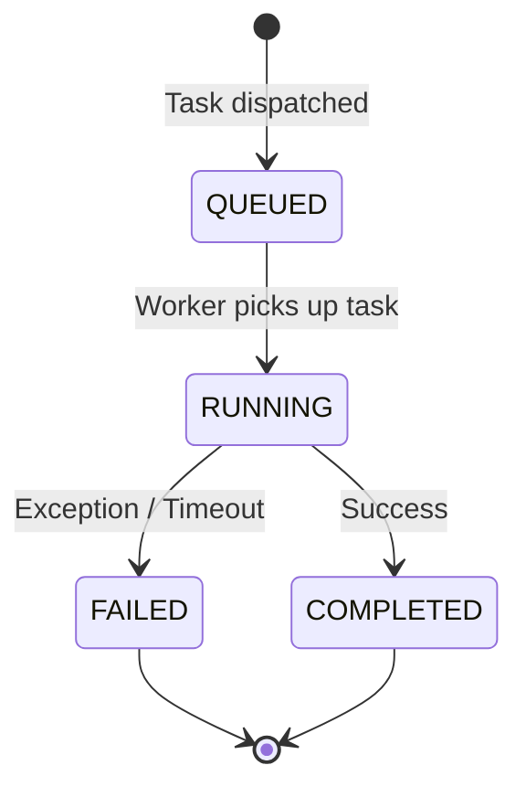

# QuantPilot AI — Async Architecture

## 1. Overview

Async processing in QuantPilot uses **Celery** with **Redis** as both message broker and result backend. Only two types of tasks are mandatory:

1. **Backtest execution** — CPU-bound, runs backtesting.py
2. **Document embedding** — I/O-bound, calls Gemini Embedding API

---

## 2. Infrastructure

```text
┌──────────┐     ┌──────────┐     ┌──────────┐
│ FastAPI  │────▶│  Redis   │────▶│  Celery  │
│  (api)   │     │ (broker) │     │ (worker) │
└──────────┘     └──────────┘     └──────────┘
                                       │
                                       ▼
                                  ┌──────────┐
                                  │PostgreSQL│
                                  │  (db)    │
                                  └──────────┘
```

### Component Roles

| Component | Role |
|---|---|
| **Redis** | Message broker (task queue) + result backend (task status) |
| **Celery worker** | Consumes tasks, executes backtest/embedding logic, writes results to PostgreSQL |
| **FastAPI** | Dispatches tasks via `celery.send_task()`, never executes long-running work inline |

---

## 3. Celery Configuration

```python
# Core settings
broker_url = "redis://redis:6379/0"
result_backend = "redis://redis:6379/1"
task_serializer = "json"
result_serializer = "json"
accept_content = ["json"]
timezone = "UTC"
enable_utc = True

# Task routing
task_routes = {
    "tasks.run_backtest": {"queue": "backtest"},
    "tasks.embed_document": {"queue": "embedding"},
}

# Worker settings
worker_concurrency = 2  # Two worker processes
worker_prefetch_multiplier = 1  # Don't prefetch; pick up one task at a time
task_acks_late = True  # Acknowledge after completion, not on receipt
```

---

## 4. Queues

| Queue | Tasks | Concurrency | Rationale |
|---|---|---|---|
| `backtest` | `run_backtest` | CPU-bound | Backtesting.py is computationally intensive |
| `embedding` | `embed_document` | I/O-bound | Embedding API calls are network-bound |

### Why two queues?

Separation allows:
- Independent scaling (more backtest workers vs. more embedding workers)
- Different concurrency settings if needed
- Priority management (backtests don't block document processing and vice versa)

In the MVP, a single worker process can consume from both queues.

---

## 5. Task Definitions

### 5.1 `run_backtest`

```python
@celery_app.task(
    bind=True,
    name="tasks.run_backtest",
    queue="backtest",
    max_retries=0,
    soft_time_limit=300,  # 5 minutes
    time_limit=360,  # 6 minutes (hard kill)
    acks_late=True,
)
def run_backtest(self, backtest_id: int) -> None:
    """
    Payload: backtest_id only (all data read from DB inside worker)

    Steps:
    1. ATOMIC UPDATE: `UPDATE backtests SET status = 'RUNNING' WHERE id = :id AND status = 'QUEUED';`
    2. Check affected rows: If 0, another worker owns this task. Abort execution.
    3. Load strategy rules_json from DB
    4. Load OHLCV data from DB
    5. Interpret strategy → backtesting.py Strategy class
    6. Execute backtest
    7. Calculate metrics
    8. INSERT backtest_results + UPDATE status = COMPLETED (single transaction)

    On failure:
    - UPDATE status = FAILED + error_message
    """
```

### 5.2 `embed_document`

```python
@celery_app.task(
    bind=True,
    name="tasks.embed_document",
    queue="embedding",
    max_retries=3,
    retry_backoff=True,  # Exponential backoff
    retry_backoff_max=60,  # Max 60s between retries
    soft_time_limit=600,  # 10 minutes (large PDFs)
    time_limit=660,  # 11 minutes hard kill
    acks_late=True,
)
def embed_document(self, document_id: int) -> None:
    """
    Payload: document_id only

    Steps:
    1. UPDATE document status = PROCESSING
    2. Read PDF from filesystem
    3. Extract text per page (PyMuPDF)
    4. Chunk pages
    5. Batch embed chunks (Gemini API)
    6. INSERT all chunks (single transaction)
    7. UPDATE document status = READY, page_count

    On failure:
    - Rollback any partial chunks
    - UPDATE status = FAILED + error_message
    - Retry if retriable (API timeout/rate limit)
    """
```

---

## 6. Task Lifecycle



### State Persistence

Task status is stored in **two places**:

1. **Redis** — Celery's native result backend (ephemeral, for task tracking)
2. **PostgreSQL** — `backtests.status` / `documents.status` (durable, for API queries)

The PostgreSQL status is the **source of truth** for the application. Redis status is only used for Celery's internal task management.

---

## 7. Retry Policy

| Task | Retries | Backoff | Rationale |
|---|---|---|---|
| `run_backtest` | 0 | N/A | Backtest failures are deterministic — retrying won't fix the issue |
| `embed_document` | 3 | Exponential (max 60s) | Embedding API failures may be transient (rate limit, network) |

### Retry Decision Logic

```python
# embed_document error handling
try:
    embed_chunks(texts)
except RateLimitError:
    raise self.retry(exc=e)  # Retriable
except TimeoutError:
    raise self.retry(exc=e)  # Retriable
except InvalidInputError:
    mark_failed(document_id, str(e))  # Not retriable — bad input
    raise
```

---

## 8. Timeout Design

| Task | Soft Limit | Hard Limit | Behavior |
|---|---|---|---|
| `run_backtest` | 300s | 360s | Soft: graceful FAILED. Hard: process killed. |
| `embed_document` | 600s | 660s | Soft: graceful FAILED. Hard: process killed. |

### Hard Timeout Recovery

If a hard timeout kills the worker process:
- The task's PostgreSQL status remains `RUNNING` (no cleanup ran)
- A health check / startup scan can detect stuck tasks:

```sql
-- Find backtests stuck in RUNNING for > 10 minutes
SELECT id FROM backtests
WHERE status = 'RUNNING'
AND updated_at < NOW() - INTERVAL '10 minutes';
```

These can be marked FAILED with "Worker timeout — task did not complete."

---

## 9. Document Embedding: Asynchronous Execution

The locked product specification requires that **embedding runs execute as background Celery tasks**.

### Design Decision: **Asynchronous Only**

Document ingestion (extract → chunk → embed → store) runs **asynchronously** via the Celery `embed_document` task.

**Workflow:**
1. API receives PDF upload
2. API validates and creates document record with `status = PROCESSING`
3. API dispatches `embed_document` Celery task
4. API returns immediate response (`202 Accepted` or similar) to client
5. Client polls or subscribes to document status until `READY` or `FAILED`

**Rationale:**
- Prevents long-running HTTP requests (PDF processing can take minutes)
- Decouples API availability from embedding model rate limits
- Provides consistent pattern with backtest execution

---

## 10. Worker Configuration (Docker)

```yaml
# docker-compose.yml (worker service)
worker:
  build: .
  command: celery -A app.workers.celery_app worker
           --loglevel=info
           --concurrency=2
           --queues=backtest,embedding
           --prefetch-multiplier=1
  depends_on:
    - db
    - redis
  environment:
    - DATABASE_URL=postgresql+asyncpg://...
    - REDIS_URL=redis://redis:6379/0
    - GEMINI_API_KEY=${GEMINI_API_KEY}
```

---

## 11. Monitoring

### Task Status Queries

```python
# Check backtest status via API (reads from PostgreSQL, not Redis)
GET /api/v1/backtests/{id}
→ {id: 42, status: "RUNNING", ...}

# Check document status via API
GET /api/v1/documents
→ [{id: 1, status: "READY", page_count: 147, ...}]
```

### Health Checks

```python
# Worker health: Celery ping
celery_app.control.ping(timeout=5)

# Queue depth: Redis LLEN
redis_client.llen("backtest")
redis_client.llen("embedding")
```
