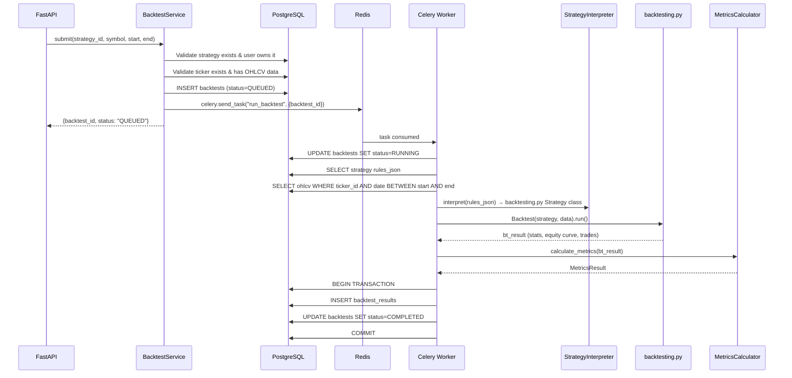

# QuantPilot AI — Backtest Architecture

## 1. Overview

Backtesting in QuantPilot uses **backtesting.py** as the execution engine, with all backtests running as **Celery tasks** — never inline in an HTTP request.

---

## 2. Strategy JSON Format

### 2.1 Schema (Version 1)

```json
{
  "version": 1,
  "entry": {
    "conditions": [
      {
        "indicator": "sma",
        "params": {"period": 10},
        "operator": "crosses_above",
        "against": {
          "indicator": "sma",
          "params": {"period": 30}
        }
      }
    ],
    "logic": "AND"
  },
  "exit": {
    "conditions": [
      {
        "indicator": "sma",
        "params": {"period": 10},
        "operator": "crosses_below",
        "against": {
          "indicator": "sma",
          "params": {"period": 30}
        }
      }
    ],
    "logic": "AND"
  },
  "position_sizing": {
    "type": "fixed_fraction",
    "value": 1.0
  }
}
```

### 2.2 Schema Elements

#### Condition

```python
class StrategyCondition(BaseModel):
    indicator: str  # sma, ema, rsi, macd, bollinger, atr
    params: dict  # Indicator-specific parameters
    operator: str  # gt, lt, gte, lte, crosses_above, crosses_below, eq
    against: ConditionTarget  # What to compare against


class ConditionTarget(BaseModel):
    # Exactly one of these must be set:
    indicator: str | None = None  # Compare against another indicator
    params: dict | None = None  # Params for the comparison indicator
    value: float | None = None  # Compare against a fixed value
```

#### Supported Operators

| Operator | Meaning | Example |
|---|---|---|
| `gt` | Greater than | RSI(14) > 70 |
| `lt` | Less than | RSI(14) < 30 |
| `gte` | Greater than or equal | — |
| `lte` | Less than or equal | — |
| `eq` | Equal (with tolerance) | — |
| `crosses_above` | Current bar crosses above | SMA(10) crosses above SMA(30) |
| `crosses_below` | Current bar crosses below | SMA(10) crosses below SMA(30) |

#### Position Sizing

| Type | Value | Meaning |
|---|---|---|
| `fixed_fraction` | 1.0 | Use 100% of available equity |
| `fixed_fraction` | 0.5 | Use 50% of available equity |

### 2.3 Validation Rules

1. `version` must be 1 (current schema version)
2. `entry.conditions` must have at least one condition
3. `exit.conditions` must have at least one condition
4. All `indicator` values must be one of the six supported indicators
5. `operator` must be one of the supported operators
6. `against` must have exactly one of `indicator` or `value` set
7. Indicator `params` must be valid for the indicator type
8. `position_sizing.value` must be 0 < value ≤ 1

### 2.4 Versioning

The `version` field allows future strategy format changes without breaking existing strategies. The StrategyInterpreter checks the version and selects the appropriate interpretation logic.

---

## 3. Backtest Execution Flow



---

## 4. Strategy Interpreter

The `StrategyInterpreter` translates declarative JSON rules into a concrete `backtesting.py` `Strategy` subclass.

### 4.1 Interface

```python
class StrategyInterpreter:
    """Translates JSON strategy rules into backtesting.py Strategy."""

    def interpret(self, rules_json: dict) -> type[Strategy]:
        """
        1. Validate version
        2. Parse entry conditions
        3. Parse exit conditions
        4. Parse position sizing
        5. Generate a Strategy subclass with init() and next() methods
        6. Return the Strategy class (not instance)
        Raises:
            ValidationError: If strategy JSON is malformed or uses unsupported features.
        """
        pass

### 4.2 Interpreter Logic

The interpreter translates the declarative strategy definition into the execution framework format.

**Key responsibilities**:
- Dynamically build a `backtesting.Strategy` subclass.
- **Indicator Source of Truth**: The interpreter MUST reuse the existing `app.domain.indicators.*` calculator classes implemented in Phase 2. The SMA/EMA/RSI/MACD/Bollinger/ATR formulas must NOT be duplicated inside Phase 3.
- Map conditions into the `init()` (pre-calculation) and `next()` (step execution) methods natively required by `backtesting.py`.

---

### 4.3 Generated Strategy Structure

```python
# Conceptual output — the interpreter dynamically creates this:
class GeneratedStrategy(Strategy):
    # Indicators declared as class variables (backtesting.py convention)
    sma_10 = ...
    sma_30 = ...

    def init(self):
        close = self.data.Close
        self.sma_10 = self.I(SMA, close, 10)
        self.sma_30 = self.I(SMA, close, 30)

    def next(self):
        # Entry: SMA(10) crosses above SMA(30)
        if crossover(self.sma_10, self.sma_30):
            self.buy(size=self.position_size_fraction)
        # Exit: SMA(10) crosses below SMA(30)
        elif crossover(self.sma_30, self.sma_10):
            self.position.close()
```

---

## 5. Performance Metrics

### 5.1 Metric Definitions

All metrics are deterministically computed. Assumptions are documented.

#### Total Return

```text
total_return = (final_equity / initial_capital) - 1
```

#### CAGR (Compound Annual Growth Rate)

```text
elapsed_days = max(1, (end_date - start_date).days)
cagr = (final_equity / initial_capital) ^ (365.25 / elapsed_days) - 1
```

**Assumption**: 365.25 days per year convention.

#### Volatility (Annualized)

```text
daily_returns = pct_change(equity_curve)
volatility = std(daily_returns) * sqrt(252)
```

**Assumption**: 252 trading days per year.

#### Sharpe Ratio

```text
excess_returns = daily_returns - risk_free_rate_daily
sharpe = mean(excess_returns) / std(excess_returns) * sqrt(252)
```

**Assumptions**:
- Risk-free rate: 0.0 (explicitly assumed zero for Phase 3 calculation)
- Annualization factor: √252

#### Sortino Ratio

```text
target_return = 0.0
downside_deviation = sqrt(mean(min(daily_returns - target_return, 0)^2))
sortino = mean(daily_returns) / downside_deviation * sqrt(252)
```

**Assumptions**: 
- target_return: 0.0

#### Maximum Drawdown

```text
running_max = cummax(equity_curve)
drawdowns = (equity_curve - running_max) / running_max
max_drawdown = abs(min(drawdowns))
```

#### Win Rate

```text
winning_trades = count(trades where pnl > 0.0)
total_closed_trades = count(all completed trades)
win_rate = winning_trades / total_closed_trades
```

**Metric Edge Cases (Undefined -> null)**:
- If `total_closed_trades` = 0, `win_rate` = null (Break-even trades where `pnl == 0.0` are NOT considered winning trades).
- If return volatility = 0.0, `sharpe` = null.
- If downside deviation = 0.0, `sortino` = null.
- If `elapsed_days <= 0` -> invalid backtest / controlled validation error.

We do NOT silently convert undefined metrics to misleading zero values.

### 5.2 MetricsCalculator Interface

```python
class MetricsCalculator:
    """Deterministic computation of backtest performance metrics."""

    def __init__(self, risk_free_rate: float = 0.0, trading_days: int = 252):
        self.risk_free_rate = risk_free_rate
        self.trading_days = trading_days

    def calculate(
        self,
        equity_curve: pd.Series,  # Indexed by date
        trades: list[Trade],  # List of completed trades
        initial_capital: float,
        start_date: date,
        end_date: date,
    ) -> BacktestMetrics:
        """Compute all seven metrics + total_trades."""
        ...
```

---

## 6. Celery Task Design

### 6.1 Task Definition

```python
@celery_app.task(
    bind=True,
    name="run_backtest",
    max_retries=0,  # No automatic retry — backtest failures are deterministic
    soft_time_limit=300,  # 5-minute soft limit
    time_limit=360,  # 6-minute hard limit
    acks_late=True,  # Acknowledge after completion
)
def run_backtest_task(self, backtest_id: int):
    """Execute a backtest as a Celery task."""
    ...
```

### 6.2 Task Payload

The Celery task receives only `backtest_id`. All data (strategy, ticker, dates) is read from the database inside the worker. This avoids:
- Large payloads in Redis
- Stale data in the task queue
- Serialization issues with complex objects

### 6.3 Task Lifecycle

```text
State       │ Trigger                    │ Database Update
────────────┼────────────────────────────┼─────────────────────────
QUEUED      │ Task dispatched to Redis   │ INSERT backtest (status=QUEUED)
RUNNING     │ Worker picks up task       │ UPDATE status=RUNNING
COMPLETED   │ Engine finishes + metrics  │ UPDATE status=COMPLETED + INSERT results
FAILED      │ Exception in worker        │ UPDATE status=FAILED + error_message
```

### 6.4 Timeout Handling

| Timeout | Duration | Behavior |
|---|---|---|
| Soft time limit | 300s (5 min) | `SoftTimeLimitExceeded` raised; task catches it, marks FAILED with "Backtest timed out" |
| Hard time limit | 360s (6 min) | Worker process killed by Celery; task remains in RUNNING state |

**Recovery from hard timeout**: A periodic cleanup job (or manual check) can detect backtests stuck in RUNNING state for > 10 minutes and mark them FAILED.

### 6.5 Error Handling in Worker

```python
try:
    # Atomic Ownership Check:
    # UPDATE backtests SET status = 'RUNNING' WHERE id = :id AND status = 'QUEUED'
    # if affected_rows == 0: return (task is already claimed or completed)
    affected_rows = atomic_update_status(backtest_id, from_status="QUEUED", to_status="RUNNING")
    if affected_rows == 0:
        return

    strategy_class = interpreter.interpret(rules_json)

    # Execution Timing:
    # trade_on_close = False
    # Execution Model: signal/decision at bar t close -> market order generated -> execution at bar t+1 open
    # This is strictly required for reproducibility and look-ahead-bias control.

    # Execution-Cost Model Mapping:
    # QuantPilot commission -> backtesting.py commission
    # QuantPilot slippage -> backtesting.py spread
    # Note: QuantPilot slippage represents a constant spread-rate approximation in Phase 3.
    # It is NOT an institutional market-impact/slippage simulation.

    bt = Backtest(data, strategy_class, cash=initial_capital, commission=commission, margin=1.0, trade_on_close=False, exclusive_orders=True)
    # The slippage parameter is conceptually mapped to spread.
    # If backtesting.py Backtest() does not accept spread= natively,
    # the framework will subtract the spread from the data internally prior to execution.
except SoftTimeLimitExceeded:
    update_status(backtest_id, "FAILED", error="Backtest timed out after 5 minutes")
except Exception as e:
    update_status(backtest_id, "FAILED", error=str(e))
    logger.exception("Backtest failed", backtest_id=backtest_id)
```

---

## 7. Concurrency Design

### 7.1 What happens with concurrent backtests

```text
User submits Backtest A (strategy_1, AAPL, 2023-2024)
User submits Backtest B (strategy_1, AAPL, 2023-2024)   ← identical params

Timeline:
1. API creates backtest record A (id=41, status=QUEUED)
2. API creates backtest record B (id=42, status=QUEUED)
3. Worker 1 picks up A → reads OHLCV → runs engine → writes results to backtest_results(backtest_id=41)
4. Worker 1 picks up B → reads OHLCV → runs engine → writes results to backtest_results(backtest_id=42)
```

**Why this is safe:**
- OHLCV data is read-only (no concurrent writes during backtest)
- Each backtest writes to its own row in `backtest_results`
- No shared mutable state between concurrent backtests
- No distributed locking needed

### 7.2 Design decision: No idempotency key

Duplicate submissions create separate backtest records. This is intentional:
- Backtests are cheap (seconds for typical data ranges)
- No harmful side effects from duplicates
- Idempotency keys add complexity without proportional value
- Each backtest is a first-class record with its own results

### 7.3 Worker concurrency

| Setting | Value | Rationale |
|---|---|---|
| Worker concurrency | 2 (prefork) | Sufficient for development; backtests are CPU-bound |
| Prefetch multiplier | 1 | Don't prefetch tasks; pick up one at a time |

---

## 8. BacktestService Interface

```python
class BacktestService:
    """Manages backtest submission, status, and result retrieval."""

    def __init__(
        self,
        backtest_repository: BacktestRepository,
        strategy_repository: StrategyRepository,
        market_data_repository: MarketDataRepository,
        celery_app: Celery,
    ): ...

    async def submit(
        self,
        user_id: UUID,
        strategy_id: int,
        symbol: str,
        start_date: date,
        end_date: date,
        initial_capital: float = 10000.0,
        commission: float = 0.001,
    ) -> Backtest:
        """
        1. Verify strategy exists and belongs to user
        2. Verify ticker exists and has data for date range
        3. Create backtest record (status=QUEUED)
        4. Dispatch Celery task
        5. Return backtest with status
        """
        ...

    async def get_status(self, backtest_id: int, user_id: UUID) -> Backtest:
        """Get backtest status. Verifies user ownership via strategy."""
        ...

    async def get_results(self, backtest_id: int, user_id: UUID) -> BacktestResult:
        """Get backtest results. Returns NOT_FOUND if not completed."""
        ...
```

---

## 9. Market Data Flow for Backtesting

```text
yfinance
    ↓
YFinanceAdapter.fetch(symbol, start, end)
    ↓
Validate: no NaN, no missing dates, correct OHLCV schema
    ↓
Normalize: ensure consistent date format, sort by date
    ↓
MarketDataService.ingest(ticker_id, bars)
    ↓
MarketDataRepository.upsert(ticker_id, bars)
    ↓
PostgreSQL: INSERT ... ON CONFLICT (ticker_id, date) DO UPDATE
```

### Ingestion Details

| Concern | Handling |
|---|---|
| Duplicate data | Upsert on `(ticker_id, date)` — silently updates existing rows |
| Missing dates | Expected for weekends/holidays — not filled, not flagged |
| NaN values | Rows with NaN in any OHLCV field are dropped before storage |
| Date handling | All dates stored as `DATE` (no time component); timezone-naive |
| yfinance errors | Retried 3 times with exponential backoff; error raised to caller |
| Symbol validation | Must be in the fixed ticker universe (checked before API call) |
