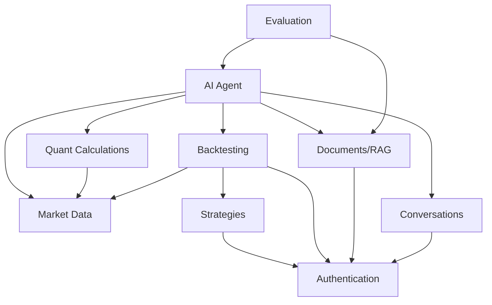

# QuantPilot AI — Component Architecture

## 1. Module Definitions

---

### Module 1: Authentication

| Property | Detail |
|---|---|
| **Responsibility** | User registration, login, JWT token issuance, password hashing, current-user resolution |
| **Owned data** | `users` table |
| **Dependencies** | None (leaf module) |
| **Public interfaces** | `AuthService.register()`, `AuthService.login()`, `get_current_user()` dependency |

**Key classes/services:**

| Class | Responsibility |
|---|---|
| `AuthService` | Registration, login, token creation |
| `UserRepository` | User CRUD against PostgreSQL |
| `PasswordHasher` | bcrypt hashing via passlib |
| `JWTHandler` | Token encode/decode |

**Failure modes:**

| Failure | Behavior |
|---|---|
| Duplicate email registration | `VALIDATION_ERROR` (409 Conflict) |
| Invalid credentials | `AUTHENTICATION_ERROR` (401) |
| Expired/invalid token | `AUTHENTICATION_ERROR` (401) |

---

### Module 2: Market Data

| Property | Detail |
|---|---|
| **Responsibility** | Ingest OHLCV data from yfinance, store in PostgreSQL, serve cached data |
| **Owned data** | `tickers` table, `ohlcv` table |
| **Dependencies** | yfinance (external, via adapter) |
| **Public interfaces** | `MarketDataService.get_ohlcv()`, `MarketDataService.ingest_ticker()` |

**Key classes/services:**

| Class | Responsibility |
|---|---|
| `MarketDataService` | Orchestrates data ingestion and retrieval |
| `MarketDataRepository` | OHLCV + ticker persistence |
| `YFinanceAdapter` | Wraps yfinance library; normalizes data |

**Data flow:**

```text
yfinance API
    ↓
YFinanceAdapter (normalize, validate)
    ↓
MarketDataService (dedup check)
    ↓
MarketDataRepository (upsert)
    ↓
PostgreSQL (ohlcv table, UNIQUE on ticker_id+date)
```

**Failure modes:**

| Failure | Behavior |
|---|---|
| yfinance timeout | `DATA_PROVIDER_ERROR` — retry with backoff, return error if persists |
| yfinance returns empty data | `DATA_PROVIDER_ERROR` — report "no data available for symbol/range" |
| Invalid symbol | `VALIDATION_ERROR` — symbol not in fixed ticker universe |
| Duplicate OHLCV rows | Handled via upsert; no error to user |

---

### Module 3: Quantitative Calculations

| Property | Detail |
|---|---|
| **Responsibility** | Deterministic calculation of technical indicators |
| **Owned data** | None (reads from `ohlcv`, returns computed values) |
| **Dependencies** | Market Data module (for OHLCV data) |
| **Public interfaces** | `IndicatorService.calculate()` |

**Key classes/services:**

| Class | Responsibility |
|---|---|
| `IndicatorService` | Dispatches to correct indicator calculation |
| `SMACalculator` | Simple Moving Average |
| `EMACalculator` | Exponential Moving Average |
| `RSICalculator` | Relative Strength Index |
| `MACDCalculator` | MACD line, signal line, histogram |
| `BollingerCalculator` | Upper/lower bands, middle band |
| `ATRCalculator` | Average True Range |

**Failure modes:**

| Failure | Behavior |
|---|---|
| Insufficient data for window | `VALIDATION_ERROR` — "need at least N data points for SMA(N)" |
| Invalid indicator name | `VALIDATION_ERROR` — "unsupported indicator" |
| Invalid parameters | `VALIDATION_ERROR` — parameter-specific error message |

---

### Module 4: Strategies

| Property | Detail |
|---|---|
| **Responsibility** | CRUD for declarative JSON strategies, validation, versioning |
| **Owned data** | `strategies` table |
| **Dependencies** | Authentication (user ownership) |
| **Public interfaces** | `StrategyService.create()`, `StrategyService.get()`, `StrategyService.list_for_user()` |

**Key classes/services:**

| Class | Responsibility |
|---|---|
| `StrategyService` | Strategy lifecycle management |
| `StrategyRepository` | Strategy persistence |
| `StrategyValidator` | Validates JSON rule structure |

**Failure modes:**

| Failure | Behavior |
|---|---|
| Invalid strategy JSON | `VALIDATION_ERROR` — schema validation errors |
| Strategy not found | `NOT_FOUND` (404) |
| Strategy belongs to another user | `AUTHORIZATION_ERROR` (403) |

---

### Module 5: Backtesting

| Property | Detail |
|---|---|
| **Responsibility** | Async backtest execution, performance metric calculation, result persistence |
| **Owned data** | `backtests` table, `backtest_results` table |
| **Dependencies** | Strategies module, Market Data module, Celery/Redis |
| **Public interfaces** | `BacktestService.submit()`, `BacktestService.get_status()`, `BacktestService.get_results()` |

**Key classes/services:**

| Class | Responsibility |
|---|---|
| `BacktestService` | Submits backtests, checks status, retrieves results |
| `BacktestRepository` | Backtest + result persistence |
| `BacktestWorker` | Celery task: loads data, interprets strategy, runs engine, computes metrics |
| `StrategyInterpreter` | Translates JSON rules into backtesting.py strategy |
| `MetricsCalculator` | Computes Total Return, CAGR, Sharpe, Sortino, etc. |

**Failure modes:**

| Failure | Behavior |
|---|---|
| Strategy not found | `NOT_FOUND` — backtest creation fails |
| Insufficient OHLCV data | `BACKTEST_ERROR` — task fails, status set to FAILED |
| backtesting.py error | `BACKTEST_ERROR` — task fails with error message |
| Worker crash | Celery marks task as failed; backtest status updated to FAILED |
| Duplicate submission | Allowed — each submission creates a new backtest record (see §Idempotency below) |

---

### Module 6: AI Agent

| Property | Detail |
|---|---|
| **Responsibility** | LangGraph agent orchestration, tool dispatch, streaming responses |
| **Owned data** | None directly (uses Conversation module for persistence) |
| **Dependencies** | All tool-owning services (Market Data, Indicators, Backtest, Documents) |
| **Public interfaces** | `AgentService.handle_message()` |

**Key classes/services:**

| Class | Responsibility |
|---|---|
| `AgentService` | Entry point for conversation messages; manages LangGraph invocation |
| `AgentGraph` | LangGraph graph definition (agent_node ↔ tool_node) |
| `LLMProvider` | Interface for LLM calls |
| `GeminiLLMAdapter` | Concrete Gemini implementation of LLMProvider |

**Tool ownership** (tools are thin adapters, not business logic):

```text
Tool Function          → Owning Service          → Domain Logic
─────────────          ─────────────────          ──────────────
get_market_data        → MarketDataService        → MarketDataRepository → DB
calculate_indicators   → IndicatorService         → SMA/EMA/RSI/... calculators
run_backtest           → BacktestService          → Celery task dispatch
get_performance_metrics→ BacktestService          → BacktestResultRepository → DB
search_documents       → RetrievalService         → pgvector search → DB
```

**Failure modes:**

| Failure | Behavior |
|---|---|
| Tool raises exception | Exception caught, formatted as tool-error message, returned to LLM for graceful response |
| LLM timeout | `AI_TOOL_ERROR` — retry once, then report failure |
| LLM rate limit | `AI_TOOL_ERROR` — report "service temporarily unavailable" |
| LLM content filter | `AI_TOOL_ERROR` — report "unable to process this request" |
| Backtest still running | Tool returns `{status: "RUNNING", backtest_id: ...}`, LLM explains to user |
| Retrieval returns empty | Tool returns empty list, LLM explicitly says "no evidence found" |

---

### Module 7: Documents / RAG

| Property | Detail |
|---|---|
| **Responsibility** | PDF upload, text extraction, chunking, embedding, vector storage, similarity search, citation |
| **Owned data** | `documents` table, `document_chunks` table, PDF files (filesystem) |
| **Dependencies** | Gemini Embedding adapter |
| **Public interfaces** | `DocumentService.ingest()`, `DocumentService.list_for_user()`, `RetrievalService.search()` |

**Key classes/services:**

| Class | Responsibility |
|---|---|
| `DocumentService` | Upload validation, orchestrates ingestion pipeline |
| `DocumentRepository` | Document + chunk persistence |
| `PDFExtractor` | PyMuPDF-based page-level text extraction |
| `TextChunker` | Splits page text into chunks respecting page boundaries |
| `EmbeddingProvider` | Interface for embedding generation |
| `GeminiEmbeddingAdapter` | Concrete Gemini embedding implementation |
| `RetrievalService` | Query embedding → cosine similarity search → ranked chunks with citations |

**Citation metadata preservation:**

```text
PDF page 7
    ↓
chunk {document_id, page_number: 7, chunk_text, embedding}
    ↓
pgvector stores (document_id, page_number, chunk_text, embedding)
    ↓
retrieval returns (document_id, page_number, chunk_text, similarity_score)
    ↓
tool output includes (document_id, page_number) per chunk
    ↓
LLM cites (document_id, page_number) in response
    ↓
API response includes structured citations
```

**Page metadata is stored at chunk creation time and never reconstructed.**

**Failure modes:**

| Failure | Behavior |
|---|---|
| Invalid file type | `VALIDATION_ERROR` — only PDF accepted |
| File too large | `VALIDATION_ERROR` — exceeds size limit |
| PyMuPDF extraction fails | `DOCUMENT_PROCESSING_ERROR` — document marked as failed |
| Embedding API fails | `DOCUMENT_PROCESSING_ERROR` — partial ingestion rolled back |
| No matching chunks | `RetrievalService` returns empty list; agent reports "insufficient evidence" |

---

### Module 8: Conversations

| Property | Detail |
|---|---|
| **Responsibility** | Conversation and message persistence, history retrieval |
| **Owned data** | `conversations` table, `messages` table |
| **Dependencies** | Authentication (user ownership) |
| **Public interfaces** | `ConversationService.create()`, `ConversationService.add_message()`, `ConversationService.get_history()` |

**Key classes/services:**

| Class | Responsibility |
|---|---|
| `ConversationService` | Conversation lifecycle, message persistence |
| `ConversationRepository` | Conversation + message CRUD |

**Failure modes:**

| Failure | Behavior |
|---|---|
| Conversation not found | `NOT_FOUND` (404) |
| Conversation belongs to another user | `AUTHORIZATION_ERROR` (403) |

---

### Module 9: Evaluation

| Property | Detail |
|---|---|
| **Responsibility** | Run evaluation questions through RAG pipeline, measure retrieval/citation accuracy |
| **Owned data** | `eval_questions` table, `eval_runs` table |
| **Dependencies** | Documents/RAG module, AI Agent module |
| **Public interfaces** | `EvaluationService.run_evaluation()`, `EvaluationService.get_results()` |

**Key classes/services:**

| Class | Responsibility |
|---|---|
| `EvaluationService` | Orchestrates evaluation: runs questions, scores results, persists runs |
| `EvaluationRepository` | Eval question + run persistence |
| `RetrievalScorer` | Computes retrieval hit@K |
| `CitationScorer` | Computes citation accuracy |
| `AnswerScorer` | Basic heuristic answer quality score |

**Failure modes:**

| Failure | Behavior |
|---|---|
| No eval questions configured | `VALIDATION_ERROR` — "no evaluation questions available" |
| Agent fails during eval | Individual question marked as failed; evaluation continues |
| RAG returns no results | Scored as retrieval miss |

---

## 2. Module Dependency Graph



### Dependency Rules

1. **Auth** is a leaf module — depended upon, depends on nothing
2. **Market Data** is a leaf module — provides data to Quant and Backtest
3. **Quant Calculations** is stateless — reads from Market Data, computes in memory
4. **AI Agent** is a composition root — it depends on multiple services but contains no business logic itself
5. **No circular dependencies** — the graph is a DAG

---

## 3. Idempotency and Concurrency

### Backtest Submission

**Design decision**: Duplicate backtest submissions are **allowed** — each creates a new backtest record.

**Rationale**:
- Backtests are cheap (run in seconds for typical data ranges)
- A user submitting twice is not harmful — they get two separate backtest results
- Idempotency keys add complexity without proportional value for this project
- The `backtests` table has a unique PK, so each submission is a distinct record

**What happens with concurrent submissions:**

```text
User submits Backtest A (strategy_1, AAPL, 2023-2024)
User submits Backtest B (strategy_1, AAPL, 2023-2024)  ← same params

Result:
- Two backtest records created (different IDs)
- Two Celery tasks dispatched
- Two workers execute independently
- Both read OHLCV data (no write conflict)
- Both write to separate backtest_results rows
- No race condition — reads are concurrent, writes are to different rows
```

**Database consistency:**
- OHLCV data is read-only during backtests (no write conflicts)
- Each backtest result writes to its own row
- No shared mutable state between concurrent backtests

### Document Ingestion

**Design decision**: Duplicate document uploads are **allowed** — each creates a new document.

**Rationale**: Users may upload revised versions of the same document. Deduplication is out of scope.

### Conversation Messages

**Design decision**: Messages are **append-only** — no idempotency concerns.

---

## 4. Inter-Module Communication

All communication is **synchronous in-process function calls** (this is a monolith).

```text
Module A
    ↓
ServiceA.method()
    ↓
ServiceB.method()  ← direct function call, same process
    ↓
RepositoryB.query()
    ↓
PostgreSQL
```

The asynchronous boundaries are **Celery task dispatch**:

```text
BacktestService.submit() / DocumentService.ingest()
    ↓
celery.send_task()  ← crosses process boundary
    ↓
Worker process picks up task
```

No message queues, event buses, or pub/sub patterns between modules.
