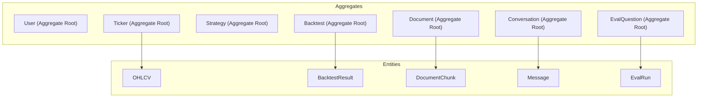

# QuantPilot AI — Domain Model

## 1. Overview

The domain model uses **lightweight DDD** — entities, value objects, and aggregates are identified where they clarify ownership and invariants, but the model is not over-engineered with unnecessary abstractions.

---

## 2. Entity Classification



---

## 3. Aggregates and Entities

### 3.1 User (Aggregate Root)

```text
User
├── id: UUID
├── email: str (unique)
├── hashed_password: str
├── created_at: datetime
└── updated_at: datetime
```

**Invariants:**
- Email must be unique across all users
- Password must be hashed before storage

**Relationships:**
- Owns: Strategies, Backtests (via Strategy), Documents, Conversations

---

### 3.2 Ticker (Aggregate Root)

```text
Ticker
├── id: int
├── symbol: str (unique)
├── name: str
└── sector: str | None
```

**Invariants:**
- Symbol must be unique
- Only tickers in the fixed universe (~30–50) are valid

**Children:**
- OHLCV records

---

### 3.3 OHLCV (Entity, child of Ticker)

```text
OHLCV
├── id: int
├── ticker_id: FK → Ticker
├── date: date
├── open: Decimal
├── high: Decimal
├── low: Decimal
├── close: Decimal
└── volume: BigInteger
```

**Invariants:**
- `(ticker_id, date)` must be unique
- `high >= low`
- `high >= open, close`
- `low <= open, close`
- `volume >= 0`

---

### 3.4 Strategy (Aggregate Root)

```text
Strategy
├── id: int
├── user_id: FK → User
├── name: str
├── rules_json: JSON
├── version: int
├── created_at: datetime
└── updated_at: datetime
```

**Invariants:**
- `rules_json` must conform to the strategy JSON schema
- Only the owning user can access/modify

**Children:**
- Backtests (referencing this strategy)

---

### 3.5 Backtest (Aggregate Root)

```text
Backtest
├── id: int
├── strategy_id: FK → Strategy
├── ticker_id: FK → Ticker
├── start_date: date
├── end_date: date
├── initial_capital: Decimal
├── commission: Decimal
├── status: BacktestStatus (enum)
├── celery_task_id: str | None
├── error_message: str | None
├── created_at: datetime
└── updated_at: datetime
```

**BacktestStatus values:**
```text
QUEUED → RUNNING → COMPLETED
                 → FAILED
```

**Invariants:**
- `start_date < end_date`
- `initial_capital > 0`
- `commission >= 0`
- Status transitions: QUEUED → RUNNING → COMPLETED/FAILED (unidirectional)

**Children:**
- BacktestResult (one-to-one, created on completion)

---

### 3.6 BacktestResult (Entity, child of Backtest)

```text
BacktestResult
├── id: int
├── backtest_id: FK → Backtest (unique)
├── total_return: Decimal
├── cagr: Decimal
├── volatility: Decimal
├── sharpe_ratio: Decimal
├── sortino_ratio: Decimal
├── max_drawdown: Decimal
├── win_rate: Decimal
├── total_trades: int
├── equity_curve_json: JSON
├── trades_json: JSON
└── created_at: datetime
```

**Invariants:**
- Exactly one result per completed backtest
- All metrics are deterministically computed, never LLM-generated

---

### 3.7 Document (Aggregate Root)

```text
Document
├── id: int
├── user_id: FK → User
├── filename: str (original user filename, for display only)
├── storage_path: str (safe internal path)
├── file_size: int
├── page_count: int
├── status: DocumentStatus (enum)
├── error_message: str | None
├── uploaded_at: datetime
└── processed_at: datetime | None
```

**DocumentStatus values:**
```text
UPLOADING → PROCESSING → COMPLETED
                       → FAILED
```

**Invariants:**
- Only PDF files accepted
- File size within configured limit
- Storage path is system-generated (never user-controlled)

**Children:**
- DocumentChunks

---

### 3.8 DocumentChunk (Entity, child of Document)

```text
DocumentChunk
├── id: int
├── document_id: FK → Document
├── page_number: int
├── chunk_index: int
├── chunk_text: str
└── embedding: vector(768)
```

**Invariants:**
- `page_number` reflects the actual PDF page the text was extracted from
- `chunk_index` is the sequential index within the page
- Page metadata is set at creation time and **never reconstructed**
- Embedding dimension is exactly 768 (matches `gemini-embedding-2`)

---

### 3.9 Conversation (Aggregate Root)

```text
Conversation
├── id: UUID
├── user_id: FK → User
├── title: str | None
├── created_at: datetime
└── updated_at: datetime
```

**Invariants:**
- Only the owning user can access

**Children:**
- Messages (ordered by created_at)

---

### 3.10 Message (Entity, child of Conversation)

```text
Message
├── id: int
├── conversation_id: FK → Conversation
├── role: MessageRole (enum)
├── content: str
├── tool_calls_json: JSON | None
├── tool_results_json: JSON | None
├── citations_json: JSON | None
└── created_at: datetime
```

**MessageRole values:**
```text
USER
ASSISTANT
TOOL
```

**Invariants:**
- Messages are append-only within a conversation
- `tool_calls_json` populated when the LLM requests tool execution
- `citations_json` populated when the response includes document citations

---

### 3.11 EvalQuestion (Aggregate Root)

```text
EvalQuestion
├── id: int
├── question: str
├── expected_answer: str
├── expected_document_id: FK → Document | None
├── expected_page: int | None
└── created_at: datetime
```

**Invariants:**
- Questions are system-defined, not user-created
- Expected page must be a valid page number in the expected document

**Children:**
- EvalRuns

---

### 3.12 EvalRun (Entity, child of EvalQuestion)

```text
EvalRun
├── id: int
├── question_id: FK → EvalQuestion
├── run_at: datetime
├── retrieved_chunks_json: JSON
├── retrieval_hit_at_k: bool
├── citation_correct: bool
├── answer_score: Decimal
├── actual_answer: str
└── actual_citations_json: JSON
```

**Invariants:**
- `retrieval_hit_at_k` is deterministically computed (was expected page in top-K?)
- `citation_correct` is deterministically computed (did response cite expected page?)
- `answer_score` is a heuristic score (keyword/overlap based)

---

## 4. Value Objects

Value objects are used for domain concepts that have no identity and are defined by their attributes:

| Value Object | Attributes | Used In |
|---|---|---|
| `DateRange` | `start: date, end: date` | Backtest, Market Data queries |
| `OHLCVBar` | `date, open, high, low, close, volume` | Market data tool output |
| `IndicatorResult` | `indicator: str, values: list[float], dates: list[date]` | Indicator tool output |
| `ChunkWithCitation` | `document_id, page_number, chunk_text, similarity_score` | RAG retrieval output |
| `BacktestMetrics` | `total_return, cagr, volatility, sharpe, ...` | Metrics tool output |
| `Citation` | `document_id, page_number` | Message citation metadata |

---

## 5. Domain Services

Domain services contain business logic that doesn't naturally belong to a single entity:

| Service | Logic |
|---|---|
| `IndicatorCalculator` | Stateless computation of SMA, EMA, RSI, MACD, Bollinger, ATR from OHLCV data |
| `MetricsCalculator` | Stateless computation of performance metrics from backtest results |
| `StrategyInterpreter` | Translates declarative JSON strategy into backtesting.py strategy class |
| `TextChunker` | Splits page text into chunks of ~500 tokens respecting page boundaries |

These are pure functions / stateless classes — no database access, no external calls.

---

## 6. Aggregate Boundaries

| Aggregate | Root | Children | Transaction Scope |
|---|---|---|---|
| User | User | — | Single-entity |
| Ticker + OHLCV | Ticker | OHLCV[] | OHLCV upsert within ticker context |
| Strategy | Strategy | — | Single-entity |
| Backtest | Backtest | BacktestResult | Backtest status + result in one transaction |
| Document | Document | DocumentChunk[] | Document + all chunks in one transaction |
| Conversation | Conversation | Message[] | Message append within conversation |
| EvalQuestion | EvalQuestion | EvalRun[] | Run append within question |

### Cross-Aggregate References

- `Strategy.user_id` → User (reference, not ownership transfer)
- `Backtest.strategy_id` → Strategy (reference)
- `Backtest.ticker_id` → Ticker (reference)
- `Document.user_id` → User (reference)
- `Conversation.user_id` → User (reference)
- `EvalQuestion.expected_document_id` → Document (reference)

Cross-aggregate references use **foreign keys** but do not imply transactional coupling. Each aggregate manages its own consistency.
