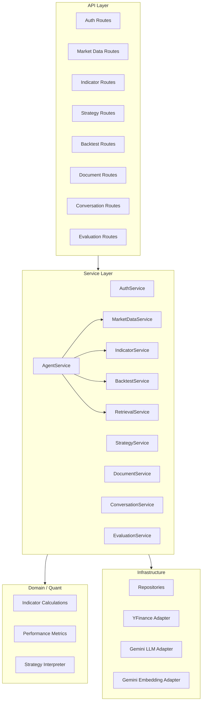
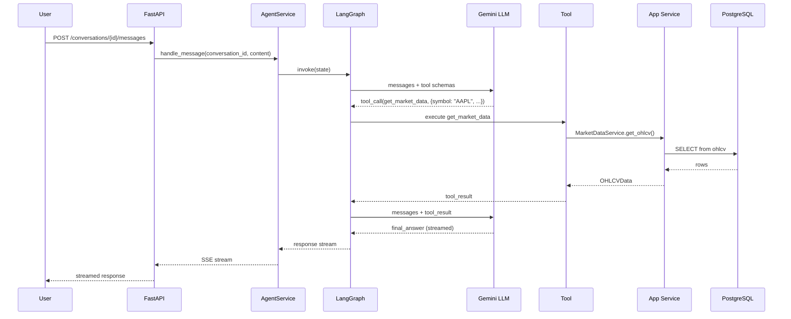
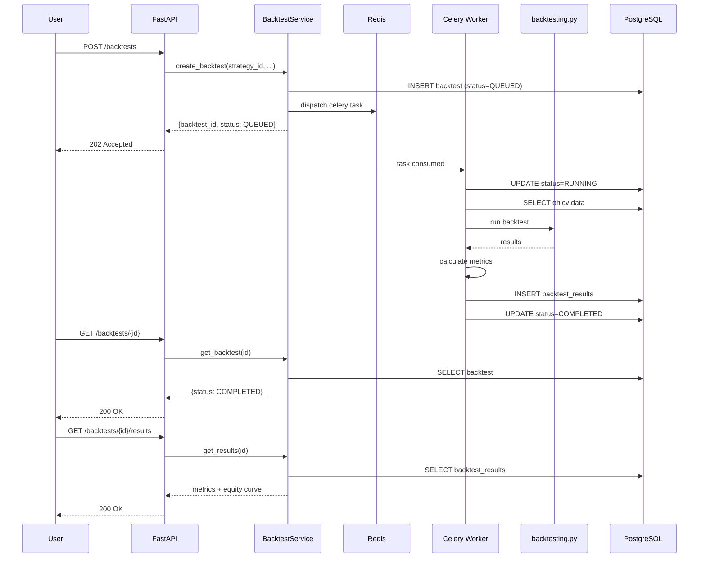
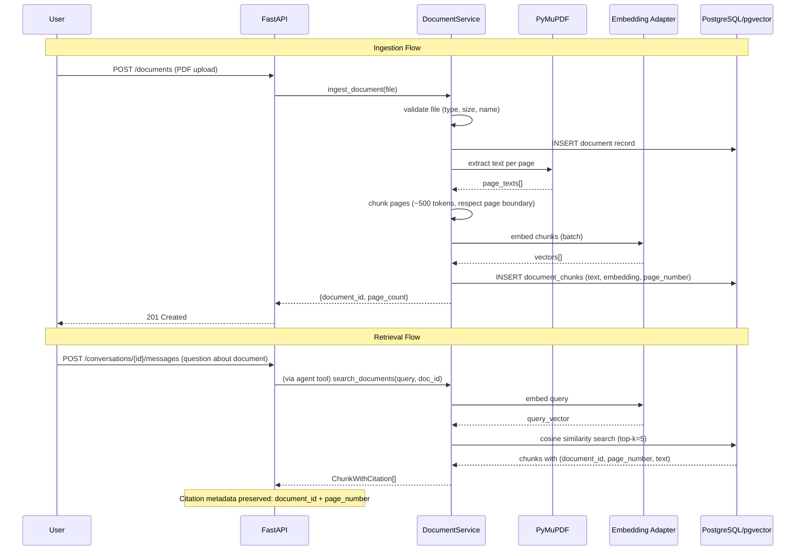

# QuantPilot AI — High-Level Design (HLD)

## 1. Product Definition

> **QuantPilot AI** is an agentic financial research assistant — a FastAPI/PostgreSQL backend with a LangGraph agent that calls deterministic Python tools instead of hallucinating numbers, RAG over financial PDFs with page-level citations, async backtesting via Celery/Redis, and an evaluation harness that measures retrieval and citation accuracy.

**Purpose**: SDE + GenAI interview project. Finance is the application domain, not the skill being demonstrated.

**Primary skills demonstrated**:
1. Software Engineering (FastAPI, PostgreSQL, Celery, Docker, testing, CI)
2. Generative AI / Agentic AI (LangGraph, tool-calling, RAG, evaluation)

---

## 2. Architecture Style

**Modular Monolith** with **Clean Architecture / Hexagonal principles**.

### Layering

```text
API Layer          ← HTTP handlers, request/response schemas
    ↓
Service Layer      ← Application workflows, orchestration
    ↓
Domain Layer       ← Business logic, calculations, rules
    ↓
Repository Layer   ← Persistence abstraction
    ↓
Infrastructure     ← PostgreSQL, Redis, Gemini SDK, yfinance
```

The domain layer does **not** depend on FastAPI, SQLAlchemy, Redis, Celery, or Gemini SDK. External providers are hidden behind adapters.

---

## 3. Three Kinds of Computation

This separation is a defining architectural characteristic of QuantPilot.

```text
                    QuantPilot
                        │
            ┌───────────┼────────────┐
            │           │            │
            ▼           ▼            ▼
          LLM       Deterministic   Async
       Reasoning       Tools        Workers
                        │            │
                 Quant / RAG     Celery
```

### 3.1 LLM Reasoning

The LLM decides **what to do**, not **what the answer is**.

```text
"What should I do?"
"Which tool should I call?"
"How should I explain the result?"
```

The LLM is **never** the source of truth for numerical results.

### 3.2 Deterministic Tools

Application services that compute ground-truth values:

```text
Calculate RSI          → pandas/numpy computation
Calculate Sharpe       → deterministic formula
Interpret strategy     → JSON rule parsing
Retrieve documents     → pgvector cosine similarity
Fetch market data      → PostgreSQL query
```

These produce reproducible, testable, verifiable results.

### 3.3 Async Workers

Long-running computations dispatched via Celery:

```text
Backtest execution     → backtesting.py engine
Embedding generation   → Gemini embedding API (batch)
```

These run outside the HTTP request lifecycle.

---

## 4. Container Architecture

```text
                     ┌───────────────────┐
                     │    Demo Client    │
                     └─────────┬─────────┘
                               │
                         HTTP / SSE
                               │
                     ┌─────────▼─────────┐
                     │      FastAPI      │
                     └─────────┬─────────┘
                               │
              ┌────────────────┼────────────────┐
              │                │                │
              ▼                ▼                ▼
       Auth Services     Agent Service    Quant Services
                              │                │
                              ▼                ▼
                         LangGraph        Indicators
                              │             Strategy
                    ┌─────────┼─────────┐    Metrics
                    │         │         │
                    ▼         ▼         ▼
                 Market    Backtest   Document
                  Tool       Tool       Tool
                    │         │         │
                    └─────────┼─────────┘
                              │
                      Application Services
                              │
                  ┌───────────┴───────────┐
                  │                       │
             PostgreSQL                Redis
                  │                       │
              pgvector                Celery
                                          │
                                      Worker
                                          │
                                   backtesting.py
```

### Container Responsibilities

| Container | Process | Responsibility |
|---|---|---|
| **api** | `uvicorn` running FastAPI | HTTP endpoints, request validation, service orchestration, agent execution, streaming |
| **worker** | Celery worker | Async backtest execution, batch embedding generation |
| **db** | PostgreSQL 16 + pgvector | Relational data, vector storage, ACID transactions |
| **redis** | Redis 7 | Celery message broker, task result backend |

---

## 5. Module Overview



### Module List

| # | Module | Responsibility |
|---|---|---|
| 1 | **Authentication** | User registration, login, JWT tokens, password hashing |
| 2 | **Market Data** | OHLCV ingestion from yfinance, storage, retrieval |
| 3 | **Quantitative Calculations** | SMA, EMA, RSI, MACD, Bollinger, ATR |
| 4 | **Strategies** | Declarative JSON strategy CRUD, validation, versioning |
| 5 | **Backtesting** | Async backtest execution via Celery + backtesting.py |
| 6 | **AI Agent** | LangGraph agent, tool orchestration, streaming |
| 7 | **Documents/RAG** | PDF ingestion, chunking, embedding, retrieval, citations |
| 8 | **Conversations** | Conversation + message persistence |
| 9 | **Evaluation** | RAG evaluation harness, retrieval/citation scoring |

---

## 6. Data Flow: AI Research Query



---

## 7. Data Flow: Backtest Execution



---

## 8. Data Flow: RAG Pipeline



---

## 9. Design Pattern Justification

| Pattern | Where Used | Justification |
|---|---|---|
| **Repository** | All database access | Isolates persistence logic from services; makes testing possible with in-memory fakes |
| **Service Layer** | All business operations | Keeps HTTP handlers thin; business logic is testable independently of FastAPI |
| **Adapter** | yfinance, Gemini LLM, Gemini Embeddings | External dependencies hidden behind interfaces; swappable without changing application logic |
| **Strategy (behavioral)** | Indicator calculations | Each indicator (SMA, EMA, RSI, etc.) follows a consistent interface but has different computation logic |
| **Unit of Work** | **Not used initially** | Single-repository transactions suffice; SQLAlchemy session already provides transaction boundaries. Will reconsider only if a business operation genuinely spans multiple aggregates |
| **Factory** | **Not used** | Object construction is straightforward; no interchangeable implementations complex enough to justify a factory |

---

## 10. Technology Decisions

| Decision | Choice | ADR |
|---|---|---|
| Architecture style | Modular Monolith | ADR-001 |
| Internal layering | Clean Architecture / Hexagonal | ADR-002 |
| Database | PostgreSQL | ADR-003 |
| Backtesting engine | backtesting.py | ADR-004 |
| Async processing | Celery + Redis | ADR-005 |
| AI agent framework | LangGraph | ADR-006 |
| Vector storage | pgvector (PostgreSQL extension) | ADR-007 |
| LLM provider | Google Gemini | ADR-006 (subsection) |
| Embedding model | `gemini-embedding-2` (768d) | ADR-007 (subsection) |

---

## 11. Cross-Cutting Concerns

### 11.1 Authentication
- JWT-based; every protected endpoint verifies token
- User can only access their own resources (strategies, backtests, documents, conversations)

### 11.2 Structured Logging
- JSON-formatted structured logs
- Fields: timestamp, level, request_id, user_id, task_id, operation, duration, error
- Sensitive data (passwords, tokens, API keys) never logged

### 11.3 Error Handling
- Typed error categories mapped to HTTP status codes
- Internal stack traces never exposed to clients
- AI tool errors caught and returned as tool-error messages to the LLM

### 11.4 Configuration
- Environment variables for all secrets and configuration
- Pydantic `BaseSettings` for typed configuration
- No secrets in source code

---

## 12. Scalability Path (Hypothetical — Not Built)

The modular monolith is designed so that, if needed in the future:

| Current | Potential Future |
|---|---|
| Single FastAPI process | Multiple uvicorn workers behind a load balancer |
| Single Celery worker | Multiple workers with task routing |
| PostgreSQL single instance | Read replicas for query scaling |
| pgvector in PostgreSQL | Could migrate to dedicated vector DB if search volume demands it |
| Modular monolith | Individual modules could be extracted to services if team grows |

**None of these are built.** This section exists only to answer "how would you scale this?" in an interview.
