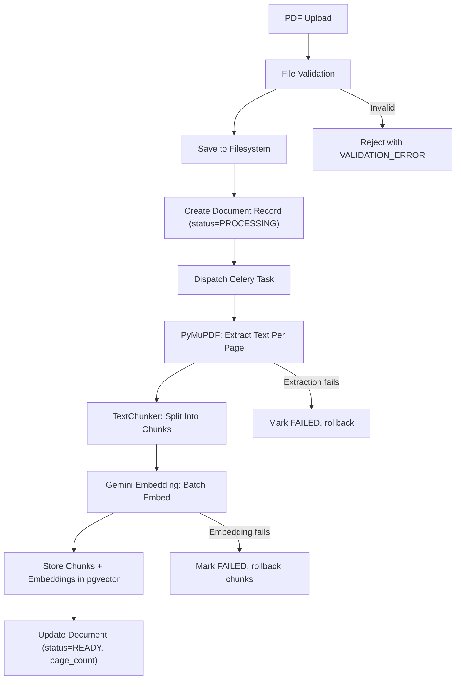
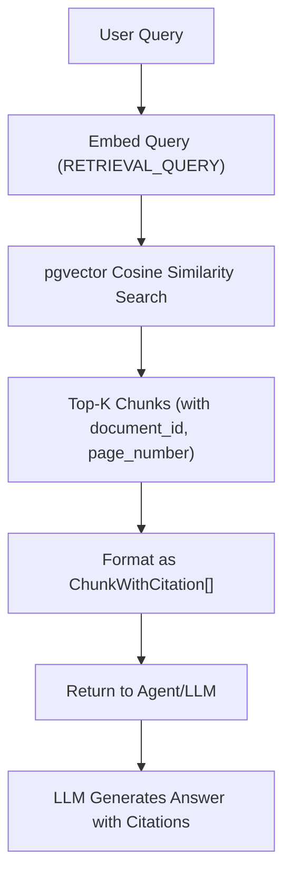

# QuantPilot AI — RAG Architecture

## 1. Overview

RAG (Retrieval-Augmented Generation) in QuantPilot supports exactly one document type:

> **10-K / annual-report PDF**

The pipeline has two phases: **ingestion** (upload time) and **retrieval** (query time).

---

## 2. Ingestion Pipeline



### 2.1 File Validation

| Check | Rule |
|---|---|
| File type | Must be `application/pdf` (MIME check + magic bytes) |
| File size | Max 50 MB (configurable) |
| Filename | Original filename stored for display; storage uses UUID-based safe name |
| Path traversal | Storage path generated server-side; user input never used in path construction |

### 2.2 Text Extraction (PyMuPDF)

```python
# Pseudocode
import fitz  # PyMuPDF


def extract_pages(pdf_path: str) -> list[PageText]:
    doc = fitz.open(pdf_path)
    pages = []
    for page_num, page in enumerate(doc, start=1):
        text = page.get_text("text")
        if text.strip():  # Skip blank pages
            pages.append(PageText(page_number=page_num, text=text))
    return pages
```

**Output**: List of `(page_number, text)` pairs — page metadata established here and never reconstructed.

### 2.3 Chunking Strategy

| Parameter | Value | Rationale |
|---|---|---|
| Target chunk size | ~500 tokens (~2000 chars) | Balances context window usage with retrieval precision |
| Page boundary rule | **Chunks never cross page boundaries** | Preserves page-level citation accuracy |
| Overlap | 0 (no overlap) | Simplicity; page boundary rule already ensures context continuity within pages |
| Minimum chunk size | 50 characters | Skip very short residual text |

```python
def chunk_page(page_number: int, text: str, max_chars: int = 2000) -> list[Chunk]:
    """Split a single page's text into chunks without crossing page boundaries."""
    chunks = []
    # Split by paragraphs first, then combine up to max_chars
    paragraphs = text.split("\n\n")
    current_chunk = ""
    chunk_index = 0

    for para in paragraphs:
        if len(current_chunk) + len(para) > max_chars and current_chunk:
            chunks.append(
                Chunk(
                    page_number=page_number,
                    chunk_index=chunk_index,
                    text=current_chunk.strip(),
                )
            )
            chunk_index += 1
            current_chunk = para
        else:
            current_chunk += "\n\n" + para if current_chunk else para

    if current_chunk.strip() and len(current_chunk.strip()) >= 50:
        chunks.append(
            Chunk(
                page_number=page_number,
                chunk_index=chunk_index,
                text=current_chunk.strip(),
            )
        )

    return chunks
```

### 2.4 Embedding

| Property | Value |
|---|---|
| Provider | Google Gemini |
| Model | `gemini-embedding-2` |
| Dimension | 768 |
| Batch size | 100 chunks per API call (API limit: 2048 per batch) |
| Task type | `RETRIEVAL_DOCUMENT` for ingestion, `RETRIEVAL_QUERY` for queries |

```python
class GeminiEmbeddingAdapter:
    """Concrete Gemini embedding implementation."""

    def __init__(self, api_key: str, model: str = "gemini-embedding-2"):
        self.client = genai.Client(api_key=api_key)
        self.model = model

    async def embed_documents(self, texts: list[str]) -> list[list[float]]:
        """Embed a batch of document chunks."""
        result = self.client.models.embed_content(
            model=self.model,
            contents=texts,
            config={"task_type": "RETRIEVAL_DOCUMENT"},
        )
        return [e.values for e in result.embeddings]

    async def embed_query(self, text: str) -> list[float]:
        """Embed a single query."""
        result = self.client.models.embed_content(
            model=self.model,
            contents=[text],
            config={"task_type": "RETRIEVAL_QUERY"},
        )
        return result.embeddings[0].values
```

### 2.5 Storage

Each chunk is stored in `document_chunks` with:

```text
document_id     → which document
page_number     → which PDF page (1-indexed)
chunk_index     → order within the page (0-indexed)
chunk_text      → raw extracted text
embedding       → vector(768)
```

**The page_number is set at extraction time and travels with the chunk through the entire pipeline. It is never reconstructed or inferred.**

### 2.6 Transaction Semantics

Document ingestion is an all-or-nothing operation:

1. INSERT document record (status=PROCESSING)
2. Extract all pages
3. Chunk all pages
4. Embed all chunks (batched API calls)
5. INSERT all chunks in a single transaction
6. UPDATE document (status=READY, page_count=N)

**If any step fails** (extraction, embedding, storage):
- All chunks for this document are rolled back
- Document status set to FAILED with error_message
- No partial chunks remain in the database

---

## 3. Retrieval Pipeline



### 3.1 Query Embedding

The user's query is embedded using the same model but with `task_type: RETRIEVAL_QUERY` for optimal asymmetric search performance.

### 3.2 Similarity Search

```sql
SELECT
    dc.document_id,
    dc.page_number,
    dc.chunk_text,
    1 - (dc.embedding <=> :query_embedding) AS similarity_score
FROM document_chunks dc
JOIN documents d ON dc.document_id = d.id
WHERE d.status = 'READY'
  AND (:document_id IS NULL OR dc.document_id = :document_id)
ORDER BY dc.embedding <=> :query_embedding
LIMIT :top_k;
```

### 3.3 Retrieval Parameters

| Parameter | Value | Rationale |
|---|---|---|
| Top-K | 5 | Sufficient context for most queries without exceeding LLM context window budget |
| Distance metric | Cosine distance (`<=>` operator) | Standard for normalized embeddings |
| Index type | HNSW | Better recall than IVFFlat for this data scale |
| Similarity threshold | None (return top-K regardless) | Let the LLM judge relevance; avoiding false negatives |
| Document filter | Optional `document_id` parameter | Allow searching all documents or a specific one |

### 3.4 Retrieval Output

```python
class ChunkWithCitation(BaseModel):
    document_id: int
    page_number: int  # The page this chunk came from
    chunk_text: str  # The actual text
    similarity_score: float  # Cosine similarity (0–1)
```

---

## 4. Citation Flow (End-to-End)

This is one of the project's strongest differentiators. Citation metadata must survive the entire pipeline without reconstruction.

```text
Step 1: PDF Extraction
    PDF page 7 → text extracted → PageText(page_number=7, text="...")

Step 2: Chunking
    PageText(page_number=7) → Chunk(page_number=7, chunk_index=0, text="...")

Step 3: Embedding + Storage
    INSERT document_chunks (document_id=1, page_number=7, chunk_index=0, text="...", embedding=[...])

Step 4: Retrieval
    SELECT → ChunkWithCitation(document_id=1, page_number=7, chunk_text="...", similarity_score=0.89)

Step 5: Tool Output
    search_documents returns: [{"document_id": 1, "page_number": 7, "chunk_text": "...", "similarity_score": 0.89}]

Step 6: LLM Response
    Agent instructed to cite (document_id, page_number) per claim:
    "According to Apple's 10-K (Document 1, Page 7), revenue increased..."

Step 7: Message Persistence
    messages.citations_json = [{"document_id": 1, "page_number": 7}]

Step 8: API Response
    Response includes structured citations array for UI rendering
```

**At no point is page_number derived, guessed, or reconstructed. It flows from PyMuPDF → chunk → database → retrieval → LLM → response → API.**

---

## 5. Embedding Configuration

The design uses one fixed embedding model with configuration as metadata:

```python
class EmbeddingConfig:
    provider: str = "google"
    model: str = "gemini-embedding-2"
    dimension: int = 768
    distance_metric: str = "cosine"
```

This is **not** a multi-provider abstraction. It documents the fixed configuration so that:
1. Database schema (`vector(768)`) matches the model output
2. Index configuration uses the correct distance operator
3. If the model changes in the future, there's one place to update

---

## 6. Failure Handling

| Failure | Impact | Handling |
|---|---|---|
| PyMuPDF can't read PDF | Ingestion fails | Document marked FAILED; error message stored |
| PDF has no extractable text | Ingestion succeeds with 0 chunks | Document marked READY with page_count=0; retrieval returns empty |
| Embedding API timeout | Ingestion fails | Retry up to 3 times with exponential backoff; on persistent failure, rollback and mark FAILED |
| Embedding API rate limit | Ingestion delayed | Batch with delays; respect rate limits |
| pgvector insert fails | Ingestion fails | Transaction rollback; document marked FAILED |
| Query embedding fails | Retrieval fails | Return `RETRIEVAL_ERROR` to agent; agent explains to user |
| No chunks above threshold | Retrieval succeeds with empty results | Agent explicitly states "no relevant evidence found in uploaded documents" |

---

## 7. RetrievalService Interface

```python
class RetrievalService:
    """Handles semantic search over document chunks."""

    def __init__(
        self,
        embedding_adapter: EmbeddingProvider,
        document_repository: DocumentRepository,
    ): ...

    async def search(
        self,
        query: str,
        document_id: int | None = None,
        top_k: int = 5,
    ) -> list[ChunkWithCitation]:
        """
        1. Embed the query using RETRIEVAL_QUERY task type
        2. Execute cosine similarity search against pgvector
        3. Return top-K chunks with citation metadata
        """
        ...
```

---

## 8. DocumentService Interface

```python
class DocumentService:
    """Handles document upload and ingestion pipeline."""

    def __init__(
        self,
        document_repository: DocumentRepository,
        pdf_extractor: PDFExtractor,
        text_chunker: TextChunker,
        embedding_adapter: EmbeddingProvider,
    ): ...

    async def ingest(
        self,
        user_id: UUID,
        file: UploadFile,
    ) -> Document:
        """
        1. Validate file (type, size)
        2. Generate safe storage path
        3. Save file to disk
        4. Create document record (status=PROCESSING)
        5. Dispatch Celery task (embed_document)
        6. Return Document (status=PROCESSING)
        """
        ...

    async def list_for_user(self, user_id: UUID) -> list[Document]:
        """List all documents for a user."""
        ...
```
