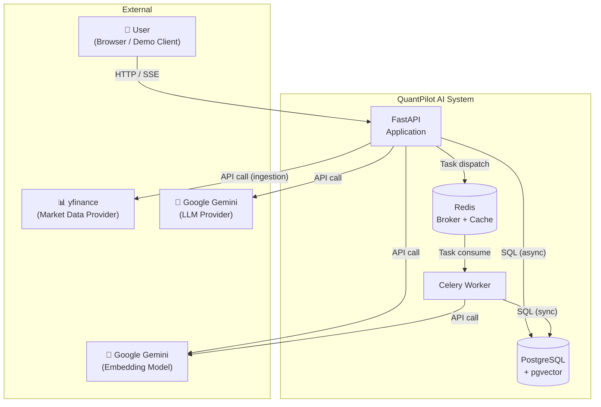
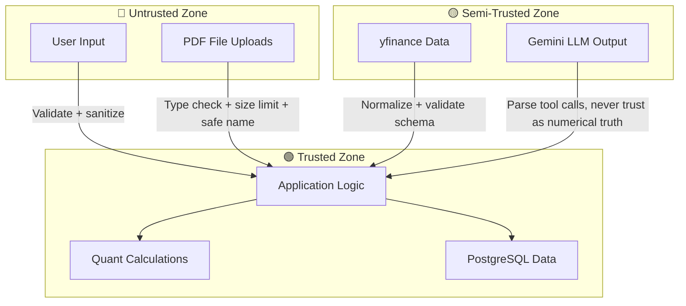

# QuantPilot AI — System Context

## 1. System Context Diagram



## 2. External Dependencies

### 2.1 yfinance (Market Data Provider)

| Property | Value |
|---|---|
| **Type** | Python library wrapping Yahoo Finance |
| **Direction** | Outbound read-only |
| **Data** | OHLCV daily bars |
| **Authentication** | None (public API) |
| **Rate limits** | Unofficial; subject to throttling |
| **Failure mode** | Network timeout, data unavailable, API changes |
| **Mitigation** | Cache all data in PostgreSQL after first fetch; never depend on live yfinance calls for user-facing requests |

### 2.2 Google Gemini — LLM

| Property | Value |
|---|---|
| **Type** | REST API via `google-genai` SDK |
| **Direction** | Outbound request/response |
| **Data sent** | User question + tool schemas + conversation context + retrieved chunks |
| **Data received** | Text response + tool call decisions |
| **Authentication** | API key (environment variable) |
| **Rate limits** | Free tier: 15 RPM / 1M TPM (Gemini 3.6 Flash) |
| **Failure mode** | Rate limit, network timeout, content filtering, API error |
| **Mitigation** | Retry with backoff; graceful error message to user |

### 2.3 Google Gemini — Embedding Model

| Property | Value |
|---|---|
| **Type** | REST API via `google-genai` SDK |
| **Model** | `gemini-embedding-2` |
| **Direction** | Outbound request/response |
| **Data sent** | Text chunks or queries |
| **Data received** | Embedding vectors |
| **Dimension** | 768 (default for `gemini-embedding-2`) |
| **Authentication** | API key (same as LLM) |
| **Failure mode** | Rate limit, network timeout |
| **Mitigation** | Batch embedding during ingestion; retry with backoff |

## 3. Trust Boundaries



### Boundary Rules

| Boundary | Rule |
|---|---|
| **User → API** | All input validated via Pydantic; authentication required for protected routes |
| **PDF → System** | File type validated, size limited, filename sanitized, path traversal prevented |
| **yfinance → System** | Data validated against expected schema; missing/NaN values handled before storage |
| **Gemini LLM → System** | LLM output is parsed for tool calls; numerical values **never** accepted from LLM — only from deterministic tools |
| **Gemini Embeddings → System** | Vector dimension validated before storage |
| **Internal services** | Trusted; no additional authentication between layers |

## 4. Data Ownership

| Data | Owner | Storage | Retention |
|---|---|---|---|
| User credentials | Auth module | `users` table | Indefinite |
| Market data (OHLCV) | Market Data module | `ohlcv` table | Indefinite (cached from yfinance) |
| Ticker metadata | Market Data module | `tickers` table | Static, seeded |
| Strategies | Strategy module | `strategies` table | User-owned, indefinite |
| Backtests + results | Backtest module | `backtests`, `backtest_results` | User-owned, indefinite |
| Documents | Document/RAG module | `documents`, `document_chunks` | User-owned, indefinite |
| Conversations | Conversation module | `conversations`, `messages` | User-owned, indefinite |
| Evaluation data | Evaluation module | `eval_questions`, `eval_runs` | System-owned, indefinite |
| PDF files | Document module | Local filesystem (Docker volume) | Linked to `documents` table |

## 5. Failure Boundaries

### 5.1 External Service Failures

| Service | Impact | System Behavior |
|---|---|---|
| **yfinance down** | Cannot ingest new market data | Already-cached data remains available; new ingestion requests fail with `DATA_PROVIDER_ERROR` |
| **Gemini LLM down** | AI agent cannot reason | Agent endpoints return `AI_TOOL_ERROR`; all non-AI features continue working |
| **Gemini Embedding down** | Cannot embed new documents or queries | Document upload fails with `DOCUMENT_PROCESSING_ERROR`; existing documents remain searchable if query embedding is cached or precomputed |
| **Redis down** | Cannot dispatch Celery tasks | Backtest/embedding submissions fail; API continues serving reads |
| **PostgreSQL down** | Total system failure | All endpoints fail; system is not available |

### 5.2 Internal Failure Isolation

```text
Failure in...          Impact radius
─────────────          ─────────────
Auth service           → Only auth endpoints affected
Market data service    → Only market data + indicator endpoints affected
Backtest worker        → Only the specific backtest task fails; other tasks unaffected
AI agent               → Only the conversation endpoint affected
RAG retrieval          → Only document search affected; agent reports "insufficient evidence"
Evaluation             → Only evaluation endpoints affected; no production impact
```

### 5.3 Cascading Failure Prevention

- **Celery worker crash**: Task marked `FAILED` in database; does not affect API process
- **LLM timeout**: Agent tool catches timeout, returns error message to LLM, LLM explains the failure gracefully
- **Embedding batch failure**: Partial ingestion is rolled back; document marked as failed
- **yfinance throttle**: Ingestion retries with exponential backoff; does not block user requests

## 6. Network Architecture (Development)

```text
┌─────────────────────────────────────────────┐
│              Docker Network                  │
│                                              │
│  ┌─────────┐  ┌─────────┐  ┌─────────┐     │
│  │   api   │  │ worker  │  │  redis  │     │
│  │ :8000   │  │         │  │ :6379   │     │
│  └────┬────┘  └────┬────┘  └─────────┘     │
│       │            │                         │
│       └─────┬──────┘                         │
│             │                                │
│       ┌─────▼─────┐                          │
│       │    db     │                          │
│       │  :5432   │                          │
│       └───────────┘                          │
│                                              │
└─────────────────────────────────────────────┘
         │
    Host :8000 (mapped)
         │
    Browser / curl
```

- **api** exposes port 8000 to host
- **db** and **redis** are internal to the Docker network
- **worker** connects to **db** and **redis** on internal network
- No external ingress beyond port 8000
