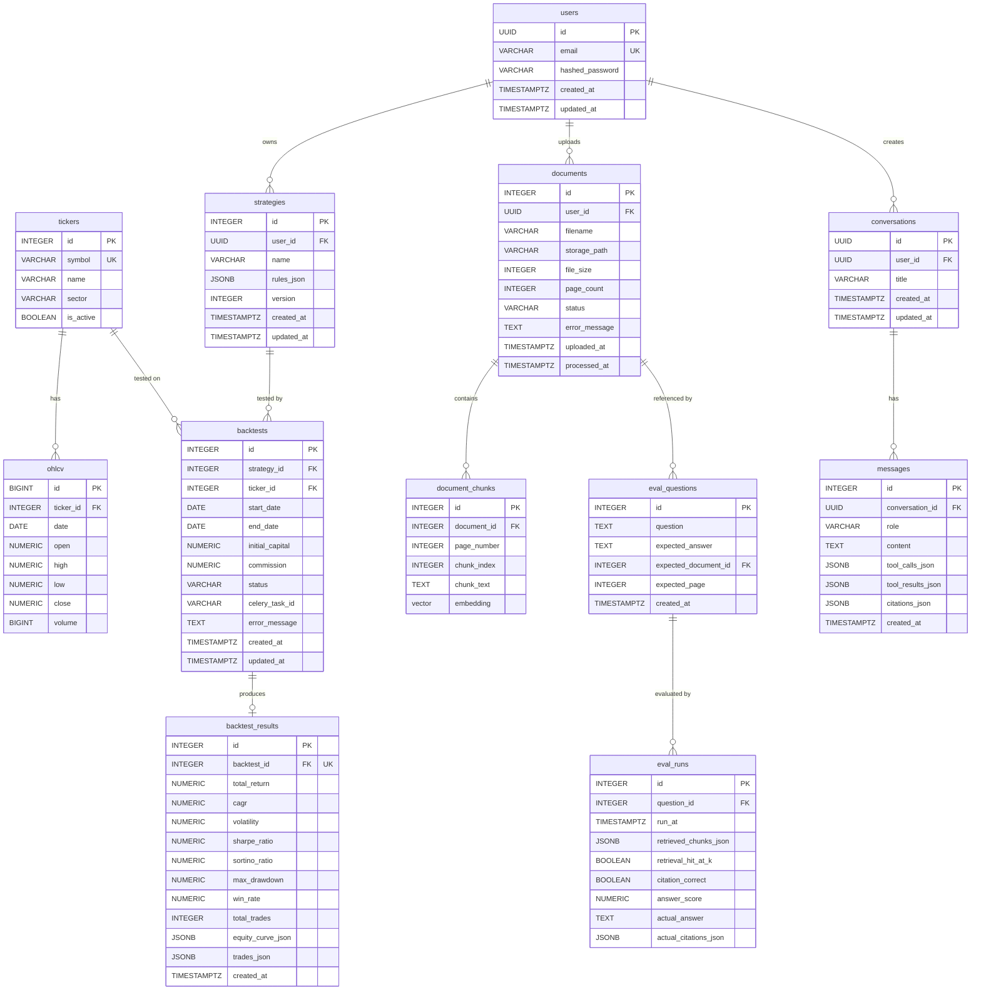

# QuantPilot AI — Entity-Relationship Diagram

## Complete ERD

## Relationship Summary

| Parent | Child | Cardinality | FK Column | ON DELETE |
|---|---|---|---|---|
| `users` | `strategies` | 1:N | `strategies.user_id` | CASCADE |
| `users` | `documents` | 1:N | `documents.user_id` | CASCADE |
| `users` | `conversations` | 1:N | `conversations.user_id` | CASCADE |
| `tickers` | `ohlcv` | 1:N | `ohlcv.ticker_id` | CASCADE |
| `tickers` | `backtests` | 1:N | `backtests.ticker_id` | RESTRICT |
| `strategies` | `backtests` | 1:N | `backtests.strategy_id` | CASCADE |
| `backtests` | `backtest_results` | 1:1 | `backtest_results.backtest_id` (UNIQUE) | CASCADE |
| `documents` | `document_chunks` | 1:N | `document_chunks.document_id` | CASCADE |
| `conversations` | `messages` | 1:N | `messages.conversation_id` | CASCADE |
| `eval_questions` | `eval_runs` | 1:N | `eval_runs.question_id` | CASCADE |
| `documents` | `eval_questions` | 1:N (optional) | `eval_questions.expected_document_id` | SET NULL |

## Key Uniqueness Constraints

| Table | Unique Constraint | Purpose |
|---|---|---|
| `users` | `email` | No duplicate accounts |
| `tickers` | `symbol` | No duplicate tickers |
| `ohlcv` | `(ticker_id, date)` | No duplicate daily bars |
| `strategies` | `(user_id, name)` | User can't have two strategies with same name |
| `backtest_results` | `backtest_id` | Exactly one result per backtest |
